# Zeitserienanalyse
von *Andreas Greiner, Julian Ivanov und Stephan Zahnweh*

## Abstract

***TODO:*** Andreas

## 1 Einleitung / Motivation

***TODO:*** Andreas

## 2 Methoden

Bei der Recherche rund um das Thema Zeitserienanalyse stößt man immer wieder auf eine mögliche Definition für Zeitserien.

!!! info "Definition"

    Die Zeitserienanalyse trägt der Tatsache Rechnung, dass Datenpunkte, die im Laufe der Zeit aufgenommen wurden, eine interne Struktur aufweisen können (wie Autokorrelation, Trend oder saisonale Schwankungen), die berücksichtigt werden sollte.

Damit grenzt sich diese von anderen Datenanalysen ohne Zeitkomponente ab. Im Folgenden werden die internen Strukturen von Zeitserien näher erläutert.


### 2.1 Merkmale von Zeitserien

Hier werden die Merkmale von Zeitserien (Autokorrelation, Trend und Saison) beschrieben.

#### Autokorrelation

Autokorrelation bezieht sich auf die statistische Beziehung oder Ähnlichkeit zwischen den Werten einer Zeitreihe und ihren verzögerten Versionen. In einer Zeitreihe werden aufeinanderfolgende Beobachtungen in regelmäßigen Zeitintervallen erfasst. Autokorrelation misst die Stärke und Richtung des linearen Zusammenhangs zwischen den Werten einer Zeitreihe und den Werten zu verschiedenen Verzögerungszeiten. Zum Veranschaulichen dieser und weiterer Methoden wird ein Beispiel Datensatz (Fig. 1) verwendet. Hierbei handelt es sich um einen Datensatz mit monatlich gemessenen CO2 Ausstoß über mehrere Jahre hinweg. 

<figure markdown>
  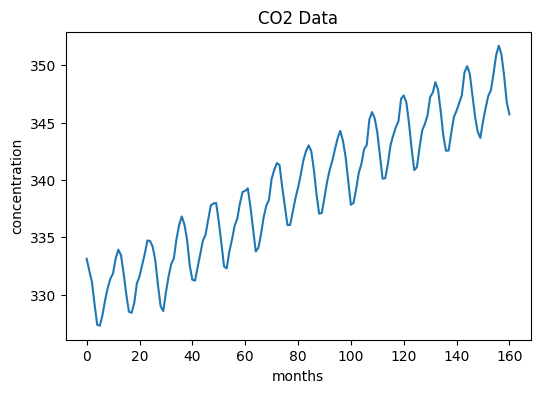{ width="400" }
  <figcaption>Fig. 1 Beispiel Datensatz</figcaption>
</figure>

Die Autokorrelationsfunktion (ACF) zeigt den Autokorrelationskoeffizient $r_k$ für verschieden Verzögerungen $k$. Er ist ein Maß für die Autokorrelation und berechnet sich wie folgt: 

$$
r_k = \frac{\sum_{t=k+1}^{n} (y_t - ӯ)(y_{t-k} - ӯ)}{\sum_{t=1}^{n} (y_t - ӯ)^2}
$$

$$
ӯ = \frac{1}{n}\sum_{t=1}^{n}(y_t)
$$

Er variiert zwischen -1 und 1. Ein Wert von 1 zeigt eine perfekte positive Autokorrelation an, was bedeutet, dass eine hohe Ähnlichkeit zwischen den Werten der Zeitreihe und ihren verzögerten Versionen besteht. Ein Wert von -1 zeigt eine perfekte negative Autokorrelation an, was darauf hindeutet, dass die Werte der Zeitreihe und ihre verzögerten Versionen genau entgegengesetzte Muster aufweisen. Ein Wert von 0 deutet auf keine Autokorrelation hin, was bedeutet, dass es keine systematische Beziehung zwischen den Werten und ihren Verzögerungen gibt. 

<figure markdown>
  { width="400" }
  <figcaption>Fig. 2 ACF Plot</figcaption>
</figure>

#### Trend

Der Trend bezieht sich auf die langfristige Veränderung des Mittelwerts einer Zeitreihe im Laufe der Zeit. Es ist wichtig den Trend zu bestimmen, da einige Modelle nur mit stationären Zeitserien umgehen können. In der Zeitreihenanalyse bedeutet "stationär", dass die statistischen Eigenschaften einer Zeitreihe im Laufe der Zeit konstant bleiben oder nicht von der Zeit abhängen. Um die Stationarität einer Zeitreihe zu überprüfen, können verschiedene statistische Tests wie der Augmented Dickey-Fuller (ADF)-Test verwendet werden. Dieser Test bewertet die Nullhypothese, dass eine Zeitreihe nicht stationär ist, und liefert Informationen darüber, ob die Zeitreihe einer Transformation bedarf, um stationär zu werden. Für den Beispiel Datensatz (Fig. 1) ergibt sich mit dem ADF-Test ein p-Wert von über 0.9, was einen eindeutigen Trend belegt.

#### Saison

Bei der Saison handelt es sich um wiederkehrende Muster oder periodische Schwankungen in den Daten einer Zeitreihe, die mit bestimmten Zeiträumen zusammenhängen. Diese Muster können tägliche, wöchentliche, monatliche, quartalsweise oder jährliche Perioden umfassen. Für den Beispiel Datensatz (Fig. 1) lässt sich eine Saison Komponente aus dem ACF Plot (Fig.2) sehr gut ablesen. Man erkennt ein wiederholtes lokales Maximum, dass in einem festen Intervall von 12 auftaucht. Dies deutet auf eine Jährliche Periode hin.

<figure markdown>
  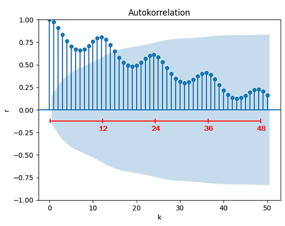{ width="400" }
  <figcaption>Fig. 3 ACF Plot Saison</figcaption>
</figure>


### 2.2 Anwendungsgebiete

Die Zeitreihenanalyse ist ein leistungsstarkes Werkzeug zur Untersuchung und Extraktion von Informationen aus sequenziellen Daten. Sie findet in verschiedenen Anwendungsgebieten Anwendung, darunter die Analyse der Merkmale, Vorhersage, Glättung und Anomalieerkennung. Jedes dieser Gebiete spielt eine wichtige Rolle bei der Auswertung und Interpretation von Zeitreihendaten.

#### Analyse der Merkmale
Die Analyse der Merkmale befasst sich mit der Untersuchung und Identifizierung von Mustern, Trends, Saisonalität und anderen Charakteristika in einer Zeitreihe. Sie hilft dabei, grundlegende Informationen über die Daten zu gewinnen und Einblicke in vergangene Muster und Veränderungen zu gewinnen. Die Werkzeuge zur Merkmalsanalyse wurden bereits im vorherigen Kapitel ausführlich erläutert.

#### Vorhersage
Die Vorhersage ist ein wichtiger Anwendungsbereich der Zeitreihenanalyse. Sie befasst sich mit der Schätzung zukünftiger Werte oder Ereignisse aufgrund vergangener Daten. Durch die Analyse von Trends, saisonalen Mustern und anderen Zeitreiheneigenschaften können Modelle entwickelt werden, um Vorhersagen für die Zukunft zu treffen. Methoden wie ARIMA (Autoregressive Integrated Moving Average), Exponential Smoothing und Machine-Learning-Algorithmen werden häufig verwendet, um Prognosen zu generieren. Diese Ansätze werden in den nächsten Kapiteln genauer betrachtet.

#### Glättung
Die Glättung bezieht sich auf den Prozess der Reduzierung von Rauschen, Unregelmäßigkeiten oder kurzfristigen Schwankungen in einer Zeitreihe, um den zugrunde liegenden Trend oder das Muster deutlicher sichtbar zu machen. Durch die Anwendung von Glättungstechniken können saisonale Effekte, Ausreißer und zufällige Schwankungen geglättet werden, um den Trend oder das langfristige Verhalten der Daten zu analysieren.

#### Anomalieerkennung
Die Anomalieerkennung in Zeitreihen beschäftigt sich mit der Identifizierung von ungewöhnlichen oder abweichenden Mustern in den Daten. Anomalien können Ausreißer, unerwartete Veränderungen, Ausfälle oder andere abnormale Ereignisse sein, die in der Zeitreihe auftreten. Die Zeitreihenanalyse kann verwendet werden, um solche Anomalien zu erkennen und zu charakterisieren, indem statistische Methoden, Mustererkennungsalgorithmen und maschinelles Lernen eingesetzt werden.

### 2.3 Klassische Ansätze

Bei der Zeitreihenanalyse gibt es verschiedene klassische Modelle, die zur Modellierung und Vorhersage von Zeitreihendaten verwendet werden. Diese Modelle basieren auf statistischen Methoden und Annahmen über die Struktur der Daten. Holt-Winters exponentielles Glätten und Box-Jenkins SARIMA Modelle sind nach deren Erfindern benannt. Beide werden in den nächsten Abschnitten vorgestellt.

#### Exponentielles Glätten

Exponentielles Glätten ist eine gängige Methode in der Zeitreihenanalyse, um saisonale Muster, Trends und kurzfristige Schwankungen zu reduzieren und den zugrunde liegenden Trend oder das Muster einer Zeitreihe deutlicher zu erkennen. Es handelt sich um eine einfache und effektive Methode, die auf der Annahme basiert, dass aktuelle Werte einer Zeitreihe stärker gewichtet werden sollten als vergangene Werte.

Der Hauptgedanke beim exponentiellen Glätten besteht darin, jedem Datenpunkt ein Gewicht zuzuweisen, wobei die Gewichte exponentiell abnehmen, je weiter der Datenpunkt in der Vergangenheit liegt. Das Gewichtungsschema wird durch einen Glättungsfaktor (auch als Glättungsparameter oder Alpha-Faktor bezeichnet) gesteuert, der zwischen 0 und 1 liegt.

Der Prozess des **einfachen exponentiellen Glättens** kann in mehreren Schritten zusammengefasst werden:

- Initialisierung:  
  Der erst mögliche geschätzte Wert $S_2$ wird als der erste Beobachtungswert $y_1$ der Zeitreihe angenommen.

$$
S_2 = y_1
$$

- Glättungsschritt:  
  Für die folgenden Beobachtungen wird der geschätzte Wert durch die Kombination des aktuellen Beobachtungswerts und des vorherigen geschätzten Werts berechnet. Dies wird durch die Formel dargestellt:  
    
    $$
    S_3 = \alpha y_2 + (1 - \alpha)S_2
    $$
    
    Dabei ist $\alpha$ der Glättungsfaktor, der angibt, wie stark der aktuelle Wert gewichtet werden soll. Ein kleinerer Wert von $\alpha$ gibt den vergangenen Werten ein höheres Gewicht, während ein größerer Wert von $\alpha$ den aktuellen Wert stärker berücksichtigt.

- Wiederholung:  
  Dieser Glättungsschritt wird für jede Beobachtung in der Zeitreihe wiederholt, wobei der geschätzte Wert bei jedem Schritt aktualisiert wird.

$$
S_t = \alpha y_{t-1} + (1 - \alpha)S_{t-1}; 0 < \alpha \leq 1; t \geq 3
$$

<figure markdown>
  { width="800" }
  <figcaption>Fig. 4 Einfaches Exponentielles Glätten</figcaption>
</figure>

Das linke Diagramm zeigt die geglättete Zeitserie und das Rechte die Ergebnisse einer Vorhersage auf den in Test- und Trainingsdaten aufgeteilten Beispieldatensatz (Fig. 1). Die Vorhersagen sind nicht sonderlich gut, da sowohl Trend als auch Saison Komponenten nicht berücksichtigt werden.

Um den Trend zu erfassen, wird das Modell um eine Trendkomponente erweitert. Hier handelt es sich um das **zweifache exponentielle Glätten**.

$$
S_t = \alpha y_{t-1} + (1 - \alpha)(S_{t-1} + b_{t-1})
$$

$$
b_t = \gamma (S_{t} - S_{t-1}) + (1 - \gamma)b_{t-1}
$$

<figure markdown>
  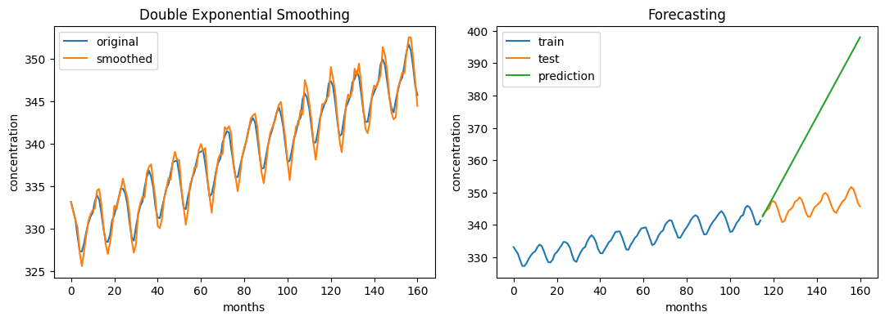{ width="800" }
  <figcaption>Fig. 5 Zweifaches Exponentielles Glätten</figcaption>
</figure>

Hier wird nun der Trend mitberücksichtigt. Man sieht bei der Glättung, dass der Trend erkannt wird, jedoch eine Änderung im Trend erst verzögert wahrgenommen wird. Auch die Vorhersagen können nur den aktuellen Trend weiterführen und keine Änderungen vorhersagen. Das liegt daran, dass die Saison Komponente fehlt um brauchbare Vorhersagen treffen zu können.

Beim **dreifachen exponentiellen Glätten** wird auch diese Berücksichtigt. Nun ergibt sich das folgende Modell:

$$
S_t = \alpha y_{t-1} + (1 - \alpha)(S_{t-1} + b_{t-1})
$$

$$
b_t = \gamma (S_{t} - S_{t-1}) + (1 - \gamma)b_{t-1}
$$

$$
I_t = \beta \frac{y_{t}}{S_t} + (1 - \beta)I_{t-L}
$$

<figure markdown>
  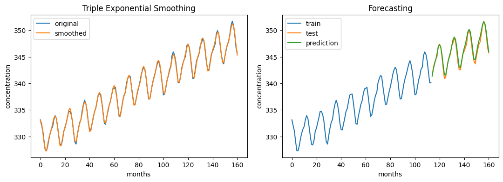{ width="800" }
  <figcaption>Fig. 6 Dreifaches Exponentielles Glätten</figcaption>
</figure>

Das Ergebnis liefert eine gute Glättung und brauchbare Vorhersagen. Es ist wichtig zu beachten, dass diese Methode für Zeitreihen geeignet ist, die keine komplexe Struktur oder starke saisonale Komponenten aufweisen. Für Zeitreihen mit starken saisonalen Mustern oder anderen komplexen Eigenschaften können fortgeschrittenere Modelle wie ARIMA oder saisonale ARIMA (SARIMA) verwendet werden. Diese werden im nächsten Abschnitt erläutert.

#### SARIMA

Das saisonale ARIMA-Modell (SARIMA) ist eine Erweiterung des ARIMA-Modells (Autoregressive Integrated Moving Average) und wird verwendet, um Zeitreihendaten mit saisonalen Mustern zu modellieren und Vorhersagen zu generieren. SARIMA kombiniert Autoregression (AR), Integration (I) und Moving Average (MA) mit saisonalen Komponenten.

Das SARIMA-Modell besteht aus mehreren Parametern, die seine Eigenschaften definieren:

- Autoregressive (AR)-Komponente:  
  Die AR-Komponente des SARIMA-Modells berücksichtigt die Abhängigkeit des aktuellen Werts einer Zeitreihe von vergangenen Werten. Der Parameter p gibt die Anzahl der vorherigen Werte an, die berücksichtigt werden sollen.  
  { width="800" }  

- Differenzierung (I):  
  Die Differenzierungskomponente des SARIMA-Modells wird verwendet, um die Zeitreihe stationär zu machen. Stationarität bedeutet, dass der Mittelwert und die Varianz der Daten über die Zeit konstant bleiben. Der Parameter d gibt die Anzahl der Differenzierungen an, die erforderlich sind, um die Stationarität zu erreichen.

- Moving Average (MA)-Komponente:  
  Die MA-Komponente des SARIMA-Modells bezieht sich auf den Einfluss der vorherigen Fehler auf den aktuellen Wert einer Zeitreihe. Der Parameter q gibt die Anzahl der vorherigen Fehler an, die berücksichtigt werden sollen.  
  { width="800" }

- Saisonale AR-Komponente:  
  Die saisonale AR-Komponente berücksichtigt die saisonale Abhängigkeit einer Zeitreihe. Sie bezieht sich auf die Abhängigkeit des aktuellen Werts von vergangenen Werten, die eine bestimmte Anzahl von Zeitschritten vor der aktuellen Periode liegen. Der Parameter P gibt die Anzahl der saisonalen AR-Terme an.

- Saisonale Differenzierung:  
  Die saisonale Differenzierung wird verwendet, um die saisonale Komponente der Zeitreihe zu entfernen und die Daten stationär zu machen. Der Parameter D gibt die Anzahl der saisonalen Differenzierungen an.

- Saisonale MA-Komponente:  
  Die saisonale MA-Komponente bezieht sich auf den Einfluss der vergangenen saisonalen Fehler auf den aktuellen Wert einer Zeitreihe. Der Parameter Q gibt die Anzahl der saisonalen MA-Terme an.

- Saisonaler Index:  
  Der Saison Index m gibt die Länge einer Periode an.

Zusammen definieren diese Parameter die Struktur des SARIMA-Modells. 

$$
SARIMA(p,d,q)(P,D,Q,m)
$$

Durch die Schätzung dieser Parameter und die Anpassung des Modells an die Daten können Vorhersagen für zukünftige Werte der Zeitreihe generiert werden. Dies ermöglicht die Berücksichtigung von saisonalen Mustern und den Einfluss vergangener Werte und Fehler auf die Vorhersagen.

<figure markdown>
  { width="400" }
  <figcaption>Fig. 7 SARIMA</figcaption>
</figure>

Die Grafik zeigt eine Vorhersage mit Hilfe des SARIMA Modells für den Beispiel Datensatz (Fig. 1). Die Ergebnisse sind sehr gut, da es sich um eine nicht sonderlich komplexe Zeitserie handelt. Obwohl SARIMA-Modelle für die Modellierung von einfachen Zeitreihen mit saisonalen Mustern recht nützlich sind, haben sie einige Nachteile beim Modellieren komplexer Strukturen. Hier haben moderne Ansätze weitaus besser Lösungen, um komplexe Muster zu erfassen. 

### 2.4 Moderne Ansätze

Moderne Ansätze in der Zeitreihenanalyse haben in den letzten Jahren an Bedeutung gewonnen und bieten erweiterte Möglichkeiten zur Modellierung und Vorhersage von Zeitreihendaten. Neuronale Netze, insbesondere rekurrente neuronale Netze (RNNs) wie Long Short-Term Memory (LSTM) oder Gated Recurrent Units (GRUs), haben sich als leistungsstarke Werkzeuge für die Modellierung von Zeitreihendaten erwiesen. Diese Modelle können komplexe nichtlineare Muster erfassen und sind in der Lage, langfristige Abhängigkeiten in den Daten zu berücksichtigen.

#### Recurrent Neural Networks

Simple RNNs (Recurrent Neural Networks) sind eine Art von neuronalen Netzwerken, die für die Analyse von Zeitreihendaten verwendet werden. Im Gegensatz zu herkömmlichen neuronalen Netzwerken, die nur eine sequenzielle Verarbeitung von Daten ermöglichen, haben RNNs die Fähigkeit, Informationen über vergangene Schritte beizubehalten und in zukünftigen Schritten zu verwenden.  

<figure markdown>
  { width="600" }
</figure>

Die grundlegende Struktur eines einfachen RNNs besteht aus einer Schleife, die es ermöglicht, Informationen über vergangene Zeitschritte zu speichern und zurückzugeben. Bei der Verarbeitung von Zeitreihendaten wird das RNN für jeden Zeitschritt in der Sequenz iterativ ausgeführt. Für jeden Zeitschritt werden sowohl der aktuelle Eingabewert als auch der vorherige Zustand des RNNs als Eingabe verwendet, um den Ausgabewert zu generieren. Der Ausgabewert kann entweder als Vorhersage für den nächsten Zeitschritt oder als Teil eines umfassenderen Vorhersagemodells verwendet werden.

<figure markdown>
  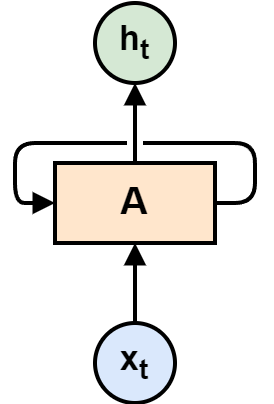{ width="150" }
  <figcaption>Fig. 8 Simple RNN</figcaption>
</figure>

Die Hauptvorteile von einfachen RNNs für die Zeitreihenanalyse liegen in ihrer Fähigkeit, zeitliche Abhängigkeiten und Muster in den Daten zu erfassen. Durch die Verwendung des vorherigen Zustands als zusätzliche Information kann das RNN kontextbezogene Vorhersagen treffen und komplexe Muster in den Daten erkennen. Beispielsweise würde ein simple RNN im Satz "Die Wolken sind im _______", das Wort *Himmel* sehr leicht aus dem Kontext einfügen können.

<figure markdown>
  { width="600" }
  <figcaption>Fig. 9 Kurzer Kontext</figcaption>
</figure>

Es gibt jedoch auch einige Herausforderungen bei der Verwendung von einfachen RNNs für Zeitreihendaten. Ein Problem ist das sogenannte "Vanishing Gradient"-Problem, bei dem die Gradienten während des Trainings exponentiell abnehmen und dazu führen können, dass vergangene Informationen nicht gut in die Vorhersagen einbezogen werden. Dies kann die Fähigkeit des RNNs zur Modellierung langfristiger Abhängigkeiten beeinträchtigen. So wird es bei dem Satz "Die Wolken, die verschiedene Größen und Graustufen haben, sind im _______", sehr schwer das Wort *Himmel* aus dem Kontext einzusetzen.

<figure markdown>
  { width="600" }
  <figcaption>Fig. 10 Langer Kontext</figcaption>
</figure>

Um das Vanishing Gradient-Problem zu überwinden und die Leistung von RNNs zu verbessern, wurden verschiedene Weiterentwicklungen vorgeschlagen, wie zum Beispiel Long Short-Term Memory (LSTM) und Gated Recurrent Units (GRU). Diese Modelle verwenden spezielle Strukturen, um das Gedächtnis der RNNs zu verbessern und langfristige Abhängigkeiten besser zu erfassen.

#### Long Short Term Memory RNNs

LSTM (Long Short-Term Memory) ist eine Weiterentwicklung von RNNs (Recurrent Neural Networks) und wurde entwickelt, um das Problem des "Vanishing Gradient" zu lösen und langfristige Abhängigkeiten in Zeitreihendaten besser zu erfassen. LSTM-RNNs haben sich als äußerst effektiv für die Zeitreihenanalyse erwiesen.

<figure markdown>
  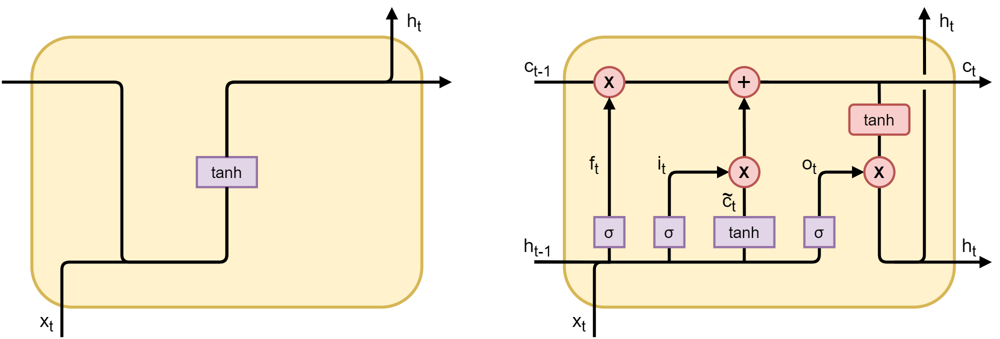{ width="800" }
  <figcaption>Fig. 11 Simple RNN vs LSTM Architektur</figcaption>
</figure>

Der wesentliche Unterschied zwischen LSTM und einfachen RNNs besteht darin, dass LSTM über eine sogenannte "Gedächtniszelle" und "Gatter" verfügt. Diese ermöglichen es, Informationen über lange Zeitschritte hinweg zu speichern und zu vergessen. Diese spezielle Architektur ermöglicht es LSTM Modellen, wichtige Informationen zu behalten und irrelevante Informationen zu verwerfen. Insgesamt ergibt sich daraus das folgende Modell:

<figure markdown>
  { width="600" }
</figure>

- Gedächtniszelle (Memory Cell):  
  Die Memory Cell besteht aus einer internen Zellzustandsvariable, die Informationen über den aktuellen Zustand der Gedächtniszelle enthält. Diese Variable wird während der Verarbeitung der Zeitreihe aktualisiert und kann Informationen über relevante Muster und Abhängigkeiten speichern.

<figure markdown>
  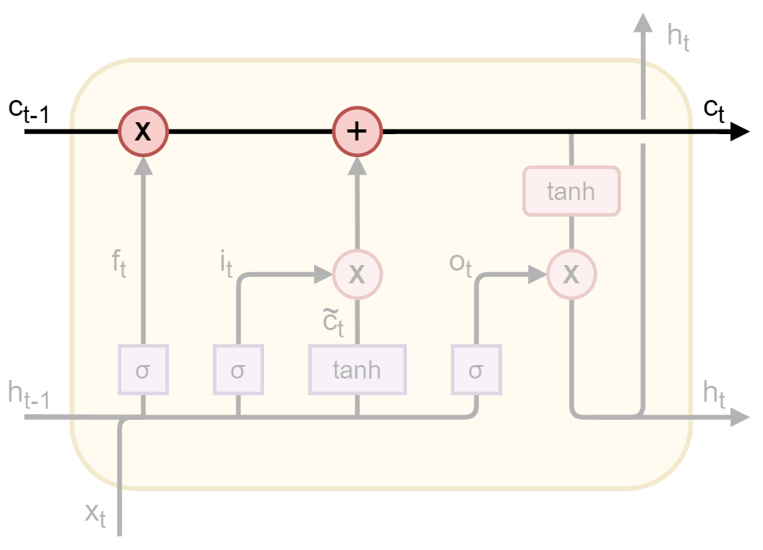{ width="400" }
  <figcaption>Fig. 12 Memory Cell</figcaption>
</figure>

- Eingangsgatter (Input Gate):  
  Das Eingangsgatter $i_t=\sigma(U_i h_{t-1} + W_i x_t + b_i)$ regelt, welche Informationen aus dem aktuellen Zeitschritt in das Zellgedächtnis übernommen werden sollen. Es verwendet eine Sigmoid-Aktivierungsfunktion, um zu bestimmen, welche Werte aktualisiert werden sollen.

<figure markdown>
  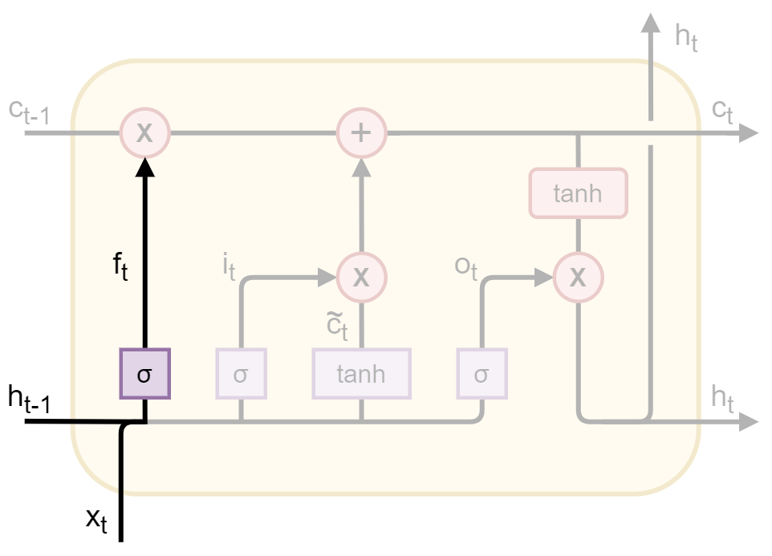{ width="400" }
  <figcaption>Fig. 13 Input Gate</figcaption>
</figure>

- Vergessensgatter (Forget Gate):  
  Das Vergessensgatter $f_t=\sigma(U_f h_{t-1} + W_f x_t + b_f)$ bestimmt, welche Informationen aus dem vorherigen Zustand des LSTM verworfen werden sollen. Es hilft dabei, irrelevante Informationen zu vergessen und relevante Informationen beizubehalten. Es verwendet auch eine Sigmoid-Aktivierungsfunktion, um zu bestimmen, welche Werte verworfen werden sollen.

<figure markdown>
  { width="400" }
  <figcaption>Fig. 14 Forget Gate</figcaption>
</figure>

- Ausgangsgatter (Output Gate):  
  Das Ausgangsgatter $i_t=\sigma(U_o h_{t-1} + W_o x_t + b_o)$ bestimmt, welche Informationen aus dem aktuellen Zeitschritt als Ausgabe verwendet werden sollen. Es verwendet sowohl die vorherigen Zustände des LSTM als auch die aktualisierten Werte des Eingangsgatters und der Zellaktivierungsfunktion, um die Ausgabe zu generieren.
  
<figure markdown>
  { width="400" }
  <figcaption>Fig. 15 Output Gate</figcaption>
</figure>

Durch die Verwendung dieser Architektur kann ein LSTM Informationen über lange Zeitschritte hinweg behalten und langfristige Abhängigkeiten in den Daten erfassen. Es kann wichtige Muster und Zusammenhänge in der Zeitreihe erkennen und diese Informationen zur Vorhersage zukünftiger Werte verwenden.

### 2.5 Vergleich

Bei der Betrachtung von Modellen für Zeitreihenanalyse können sowohl klassische als auch moderne Methoden ihre eigenen Vor- und Nachteile bieten. Die Wahl des geeigneten Modells hängt von den spezifischen Anforderungen des Anwendungsfalls ab.

Klassische Methoden zeichnen sich durch ihre Einfachheit in der Implementierung, interpretierbare Ergebnisse und die Fähigkeit aus, mit wenigen Trainingsdaten gute Vorhersagen zu liefern. Diese Methoden, wie zum Beispiel ARIMA, eignen sich gut für stationäre Daten und Anwendungen, bei denen es wichtig ist, die zugrunde liegende Struktur der Zeitreihe zu verstehen. Sie bieten solide Grundlagen und sind in vielen praktischen Szenarien immer noch effektiv einsetzbar.

Auf der anderen Seite bieten moderne Methoden, wie zum Beispiel LSTM Modelle, erweiterte Möglichkeiten zur Modellierung von Zeitreihen. Sie sind in der Lage, auch komplexe Muster und nichtlineare Zusammenhänge in den Daten zu erlernen. Moderne Methoden sind flexibler und können besser mit nicht stationären Daten umgehen, was in vielen realen Anwendungen von Vorteil ist. Sie können auch langfristige Prognosen liefern und sind in der Lage, komplexe Strukturen in den Daten zu modellieren.

## 3 Anwendungen

Im Folgenden wird anhand eines konkreten Beispiels die Vorgehensweise bei der Implementierung von Zeitreihenanalysen erläutert.

Es geht um den stündlichen Energieverbrauch in Amerika. Der Datensatz wurde zunächst eingelesen und dargestellt. Er enthält zwei Spalten. Eine mit Datum und Zeit und eine mit den Energiewerten.

<figure markdown>
  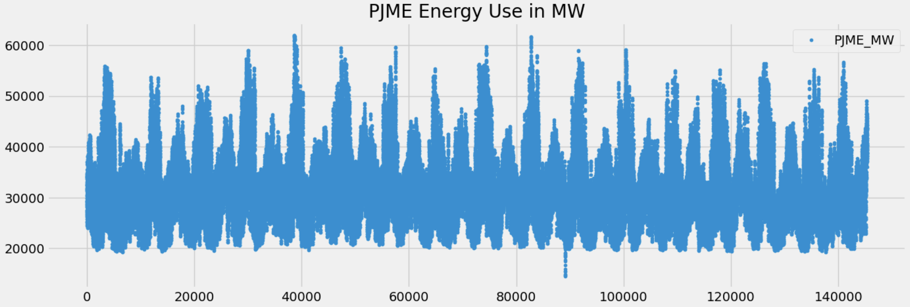
  <figcaption>Fig. 16 Energy Use in MW</figcaption>
</figure>

Als nächstes wurden die Daten aufbereitet. Dabei wurden Ausreißerwerte, die man oben in der Graphik erkennt, als auch fehlende Werte behandelt.

Ein weiterer wichtiger Schritt bei der Aufbereitung der Daten es den Index richtig zu setzen. Da wir es mit einer Zeitreihe zutun haben, müssen wir die Spalte mit dem Datum und der Zeit ("Datetime") im Datensatz als unseren Index setzen.

<figure markdown>
  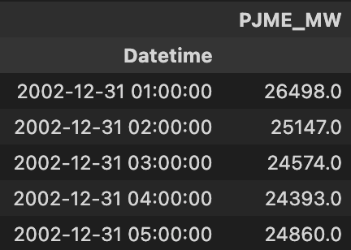
  <figcaption>Fig. 17 PJME data</figcaption>
</figure>

Indem der Index auf die Datums-/Zeitspalte gesetzt wird, ermöglicht es uns pandas, zeitbasierte Operationen effizient durchzuführen. Wir können auf einfache Weise auf bestimmte Zeiträume zugreifen, Daten nach Zeitintervallen aggregieren oder Zeitreihenplots erstellen.

Dafür müssen wir die Zeitmerkmale noch konstruieren. Dies ist jedoch dank pandas schnell getan, nachdem wir den Index richtig gesetzt haben.

```python
def create_features(df):
    """
    Create time series features based on time series index.
    """
    df = df.copy()
    df['hour'] = df.index.hour
    df['dayofweek'] = df.index.dayofweek
    df['quarter'] = df.index.quarter
    df['month'] = df.index.month
    df['year'] = df.index.year
    df['dayofyear'] = df.index.dayofyear
    df['dayofmonth'] = df.index.day
    df['weekofyear'] = df.index.isocalendar().week
    df['season'] = df['month'] % 12 // 3 + 1
    return df

season_names = {
    1: "Winter",
    2: "Spring",
    3: "Summer",
    4: "Fall"
}

df = create_features(df)
df['season'] = df['season'].map(season_names)
df.head()
```
<figure markdown>
  
  <figcaption>Fig. 17 PJME data with time features</figcaption>
</figure>

Mit den neuen Zeitmerkmalen können wir nun neue Erkenntnisse aus unseren Daten gewinnen, indem wir eine explorative Datenanalyse durchführen. Dafür können wir die Daten nach verschiedenen Zeitmerkmalen gruppieren und aggregieren.

<figure markdown>
  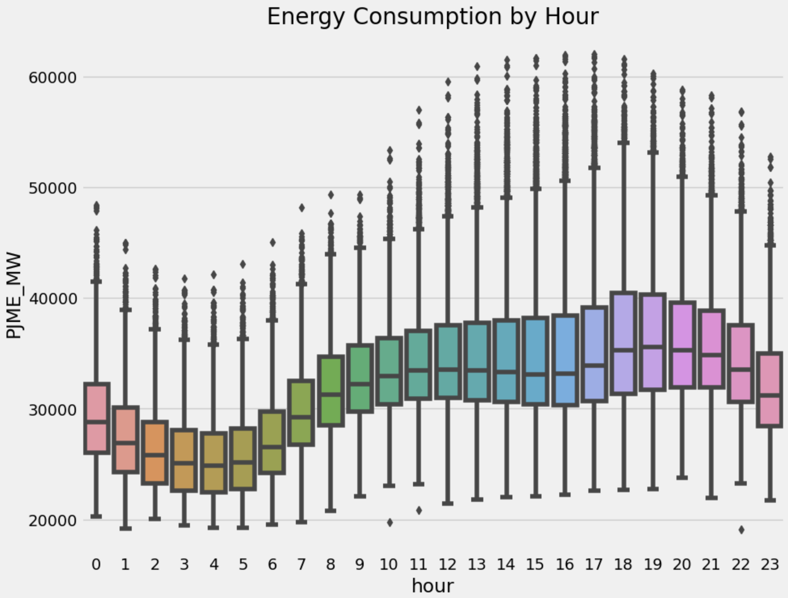
  <figcaption>Fig. 18 Energy consumption by hour</figcaption>
</figure>

<figure markdown>
  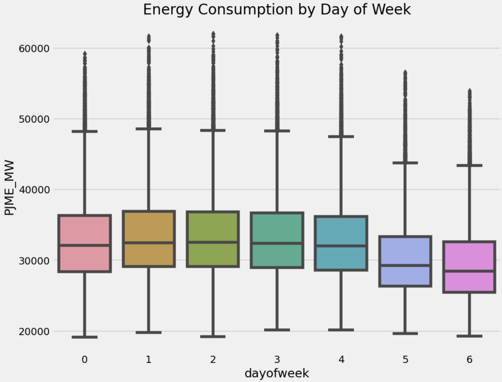
  <figcaption>Fig. 19 Energy consumption by day of week</figcaption>
</figure>

<figure markdown>
  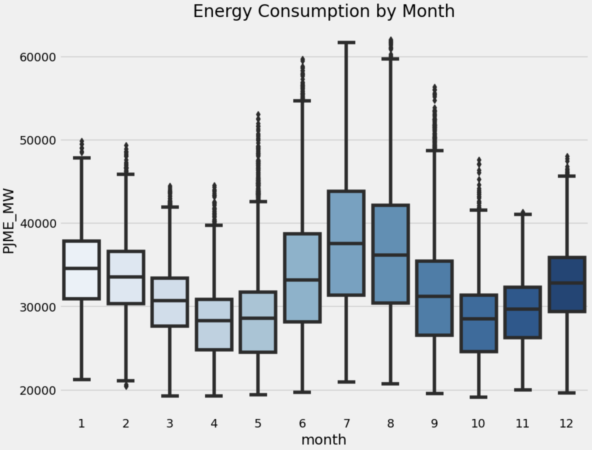
  <figcaption>Fig. 19 Energy consumption by month</figcaption>
</figure>

<figure markdown>
  
  <figcaption>Fig. 20 Energy consumption by year</figcaption>
</figure>

<figure markdown>
  
  <figcaption>Fig. 20 Energy consumption by season</figcaption>
</figure>

<figure markdown>
  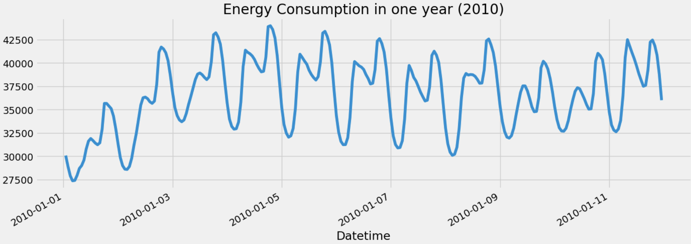
  <figcaption>Fig. 20 Energy consumption in 2010</figcaption>
</figure>

Folgende Erkenntnisse können wir aus den Graphiken gewinnen:

- Unsere Daten zeigen eine saisonale Komponente.
- Der tägliche Höchstwert liegt gegen 18 Uhr, während der niedrigste Wert um 4 Uhr morgens auftritt.
- Der geringste Energieverbrauch findet an Wochenenden (Samstag/Sonntag) statt.
- Der höchste Energieverbrauch im Jahr tritt entweder am Jahresende oder in der Mitte des Jahres auf.
- Es gibt keinen signifikanten Trend oder Veränderung im Gesamtenergieverbrauch im Zeitraum von 2002 bis 2018.
- Der höchste Energieverbrauch tritt im Sommer und dann im Winter auf.

Kommen wir nun zum Modellieren. Wir werden drei Ansätze verfolgen. SARIMA, Prophet und LSTM.
Zunächst brauchen wir jedoch die zusätzlichen Zeitmerkmale nicht mehr. Wir können sie also entfernen, sodass wir wieder nur zwei Spalten im Datensatz haben. Anschließend resamplen wir die Daten auf tägliche Werte. Dies hat den Hintergrund, dass wir sonst zu viele Datenpunkte haben und die Modelle nicht mehr effizient trainiert werden können. Vor allem SARIMA und das LSTM benötigen viel Zeit zum Trainieren. Nach dem resamplen teilen wir die Daten noch in Trainings- und Testdaten auf. Wir verwenden 80% der Daten für das Training und 20% für das Testen.

<figure markdown>
  
  <figcaption>Fig. 21 Daily energy consumption</figcaption>
</figure>

<figure markdown>
  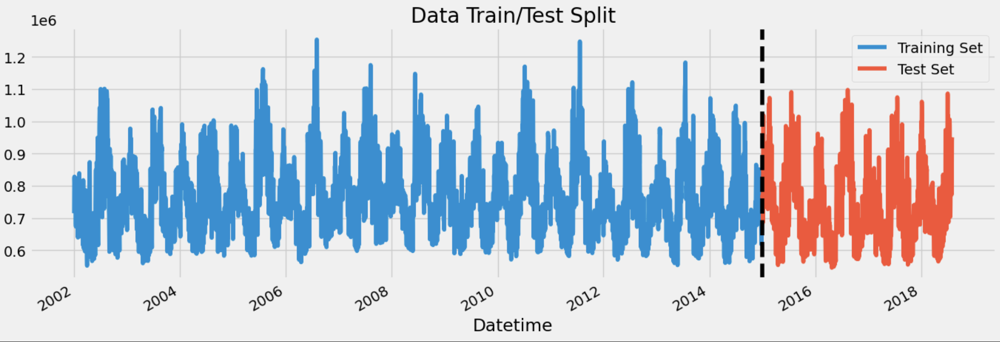
  <figcaption>Fig. 22 Train/Test split</figcaption>
</figure>

### 3.1 SARIMA

Um ein (S)ARIMA Modell zu implimentieren sollte man folgende Schritte durchführen:

1. **Überprüfung der Stationarität**: Bestimmen Sie, ob die Zeitreihe einen Trend oder eine Saisonalität aufweist. Falls dies der Fall ist, stellen Sie sicher, dass sie vor der Verwendung von ARIMA zur Vorhersage stationär ist.

2. **Differenzierung**: Wenn die Zeitreihe nicht stationär ist, wenden Sie Differenzierung an, um sie stationär zu machen. Nehmen Sie die erste Differenz und prüfen Sie auf Stationarität. Wiederholen Sie dies gegebenenfalls, einschließlich saisonaler Differenzierung.

3. **Aufteilung der Validierungsstichprobe**: Reservieren Sie einen Teil der Daten für die Validierung, um die Genauigkeit des Modells zu bewerten. Verwenden Sie eine Aufteilung der Daten in Trainings- und Testdaten.

4. **Auswahl der AR- und MA-Terme**: Analysieren Sie die Autokorrelationsfunktion (ACF) und die partielle Autokorrelationsfunktion (PACF), um festzustellen, welche AR-Terme, MA-Terme oder beides im Modell enthalten sein sollten.

5. **Modellerstellung**: Konstruieren Sie das ARIMA-Modell und legen Sie die Anzahl der Perioden fest, die basierend auf Ihren Anforderungen vorhergesagt werden sollen (N).

6. **Validierung des Modells**: Vergleichen Sie die vorhergesagten Werte mit den tatsächlichen Werten in der Validierungsstichprobe.

Die Bibliothek statsmodels bietet uns alle Funktionen, die wir für die Implementierung eines SARIMA-Modells benötigen. Mit `seasonal_decompose` zerlegen wir die Zeitreihe in ihre Trend-, saisonale und Restkomponenten. 

<figure markdown>
  
  <figcaption>Fig. 23 Seasonal decompose</figcaption>
</figure>

Der Datensatz weißt eine sehr hohe sesonale Komponente auf.

Die Funktion `adfuller` wird verwendet, um die Stationarität der Zeitreihe zu überprüfen. Ist der p-Wert kleiner als 0.05, so ist die Zeitreihe stationär.

<figure markdown>
  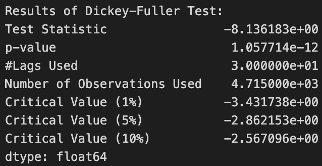
  <figcaption>Fig. 23 Adfuller test</figcaption>
</figure>


Da unser Datensatz bereits stationär ist, müssen wir keine weitere Differenzierung durchführen. Die Aufteilung in Trainings- und Testdaten ist ebenso bereits erledigt. Um die Werte für p, d und q zu bestimmen, können die ACF und PACF Plots verwenden. Es bietet sich jedoch noch eine effektivere Möglichkeit an. Die Funktion `auto_arima` der Bibliothek pmdarima. Diese Funktion führt eine Rastersuche durch, um die optimalen Parameter für unser Modell zu finden. Wir geben der Funktion auch an, dass wir eine saisonale Komponente haben.

```python
from pmdarima.arima import auto_arima

auto_model = auto_arima(train, 
           start_p=0, start_q=0, max_p=10, max_q=10, 
           seasonal=True, m=7,
           d=None, D=None, trace=True, 
           error_action='ignore', suppress_warnings=True, 
           stepwise=True, seasonal_test='ch')

print(auto_model.summary())
```
Das "m" steht für die Anzahl der Perioden pro Saison. In unserem Fall haben wir 7 Tage gewählt. 30 Tage wäre auch möglich gewesen, jedoch ist die Berechnung dann sehr aufwendig.

Diese Funktion liefert uns folgende Parameter: SARIMAX(2, 0, 0)x(1, 1, [1], 7)
Diese Parameter können wir nun in unser Modell einsetzen.

```python
model = SARIMAX(train, 
                order=(2, 0, 0),
                seasonal_order=(1, 1, 1, 7),
                enforce_stationarity=False, 
                enforce_invertibility=False)

result = model.fit()
result.summary()
```
Nun können wir unser Modell auf die Testdaten anwenden.

```python
# Convert the datetime index of test data to numeric index
test_numeric_index = range(len(test))

# Predict using SARIMAX model
predictions = result.predict(start=test_numeric_index[0], end=test_numeric_index[-1])

# Assign the converted numeric index to predictions
predictions.index = test.index
```

Anschließend können wir die Vorhersage mit den tatsächlichen Werten vergleichen.

<figure markdown>
  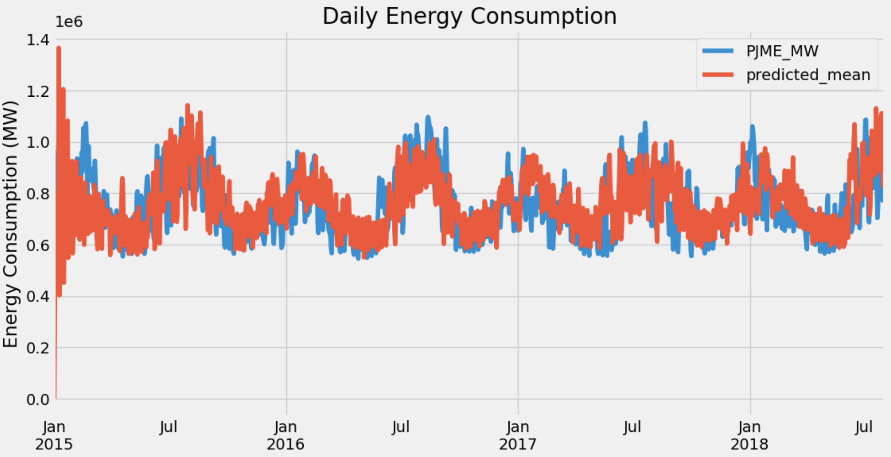
  <figcaption>Fig. 24 SARIMA prediction</figcaption>
</figure>

Um das Modell zu evaluieren und mit anderen Modellen vergleichen zu können haben wir noch den RMSE und MAPE berechnet.

SARIMA RMSE:  126971.22

SARIMA MAPE: 13.22%

Das bedeutet, dass unser SARIMA Modell im Durchschnitt um 13.22% von den tatsächlichen Werten abweicht.

### 3.2 Prophet

Das Prophet-Modell ist ein vorausschauendes Zeitreihenmodell, das von Facebook entwickelt wurde. Es basiert auf einer Additiven Modellierung, die Trends, saisonale Effekte und Feiertage berücksichtigt.Prophet verwendet ein Modell, das aus drei Hauptkomponenten besteht.

1. **Trendkomponente**: Prophet verwendet einen nichtlinearen Trendansatz, der saisonale Effekte und Veränderungen im Verlauf der Zeit berücksichtigt.

2. **Saisonale Komponente**: Das Modell erfasst saisonale Muster, indem es periodische Effekte in der Zeitreihe identifiziert und modelliert.

3. **Feiertage: Prophet ermöglicht die Berücksichtigung von spezifischen Feiertagen und Ereignissen, die Auswirkungen auf die Zeitreihe haben können.

Das Modell verwendet auch zusätzliche Anpassungsparameter, um Unsicherheiten in den Daten zu modellieren und robuste Prognosen zu generieren. Prophet ist bekannt für seine Benutzerfreundlichkeit und seine Fähigkeit, mit unvollständigen oder fehlenden Daten umzugehen. Es bietet auch eine einfache Syntax und unterstützt die automatische Erkennung von saisonalen Mustern.

Angesichts dessen, was die Implementierung sehr einfach. Wir mussten lediglich unsere Spaltennamen anpassen, sodass Prophet diese versteht. Die erste Spalte muss den Namen "ds" haben und die zweite Spalte den Namen "y". Die Spalte "ds" enthält die Zeitstempel und die Spalte "y" enthält die Werte der Zeitreihe. Daraufhin kann man das Model auch schon trainieren.

```python
from prophet import Prophet

# Format data for prophet model using ds and y
pjme_train_prophet = train.reset_index() \
    .rename(columns={'Datetime':'ds',
                     'PJME_MW':'y'})
model = Prophet()
model.fit(pjme_train_prophet)

# Predict on test set with model
pjme_test_prophet = test.reset_index() \
    .rename(columns={'Datetime':'ds',
                     'PJME_MW':'y'})

pjme_test_fcst = model.predict(pjme_test_prophet)
```

Wenn man sich den Kopf der Daten anschaut, hat Prophet viele neue Spalten hinzugefügt, dessen Werte man jedoch schwer interpretieren kann. Plottet man nun die Vorhersagen, erhalten wir folgende Graphik:

<figure markdown>
  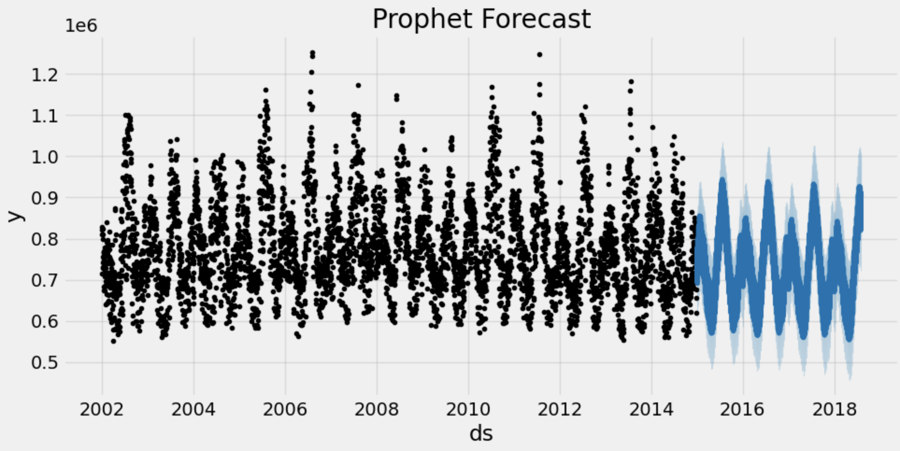
  <figcaption>Fig. 25 Prophet predictions</figcaption>
</figure>

Die Vorhersagen sehen sehr gut aus. Prophet hat die Trends und Saisonalitäten sehr gut erkannt.


<figure markdown>
  
  <figcaption>Fig. 26 Prophet predictions vs actuals</figcaption>
</figure>

Die Funktion `plot_components` zeigt die einzelnen Komponenten des Modells an. Die Komponenten sind der Trend, die saisonalen Effekte und die Feiertage (ähnlich wie beim SARIMA decompose).

Der RMSE und MAPE für das Prophet Modell sind: 78333.89 und 7.48%. Dies ist eine deutliche Verbesserung gegenüber dem SARIMA Modell.

Dank Prophet können wir auch einfach die Ferientage in unserem Modell berücksichtigen. Dazu müssen wir lediglich die Ferientage in ein Dataframe laden und Prophet mitteilen, dass es diese berücksichtigen soll.

```python
from pandas.tseries.holiday import USFederalHolidayCalendar as calendar

cal = calendar()
train_holidays = cal.holidays(start=train.index.min(),
                              end=train.index.max())
test_holidays = cal.holidays(start=test.index.min(),
                             end=test.index.max())

# Create a dataframe with holiday, ds columns
df['date'] = df.index.date
df['is_holiday'] = df.date.isin([d.date() for d in cal.holidays()])
holiday_df = df.loc[df['is_holiday']] \
    .reset_index() \
    .rename(columns={'Datetime':'ds'})
holiday_df['holiday'] = 'USFederalHoliday'
holiday_df = holiday_df.drop(['PJME_MW','date','is_holiday'], axis=1)

holiday_df['ds'] = pd.to_datetime(holiday_df['ds'])

# Setup and train model with holidays
model_with_holidays = Prophet(holidays=holiday_df)
model_with_holidays.fit(train.reset_index() \
                            .rename(columns={'Datetime':'ds',
                                             'PJME_MW':'y'}))
# Predict on training set with model
pjme_test_fcst_with_hols = \
    model_with_holidays.predict(df=test.reset_index() \
                                    .rename(columns={'Datetime':'ds'}))
```

Berechnen wir nun erneut den RMSE, stellen wir fest, dass sich dieser nicht verbessert hat.

RMSE mit Ferientagen: 78439.56

RMSE ohne Ferientage: 78333.89

Er hat sich sogar etwas verschlechtert. Dies liegt daran, dass die Ferientage in unserem Datensatz nicht sehr aussagekräftig sind, weil unser Datensatz zu groß ist. Es sind zu viele Datenpunkte vorhanden, weswegen die Ferientage eher als Rauschen betrachtet werden.

Prophet bietet auch noch eine einfach Funktion `make_future_dataframe`, um einen zukünftigten Datenrahmen zu erstellen und Vorhersagen zu treffen. Man gibt im Parameter "periods" an, wie groß der Datenrahmen sein soll. Als Beispiel haben wir 5 Jahre genommen (365 * 24 * 5).

```python
future = model.make_future_dataframe(periods=365*24*5, freq='h', include_history=False)
forecast = model_with_holidays.predict(future)
```

<figure markdown>
  
  <figcaption>Fig. 27 Prophet prediction on future dataframe</figcaption>
</figure>


### 3.3 LSTM

Bevor wir mit dem LSTM Modell starten, müssen wir unsere Daten nochmals etwas vorbereiten. Wir müssen die Daten normalisieren, damit das Modell besser trainiert werden kann. Dazu verwenden wir die MinMaxScaler Funktion von sklearn.

```python
from keras.models import Sequential
from keras.layers import Dense
from keras.layers import LSTM
from keras.layers import Dropout
from sklearn.preprocessing import MinMaxScaler
from tensorflow import keras
from tensorflow.keras import layers
from kerastuner.tuners import RandomSearch
from keras.callbacks import EarlyStopping

# Data preprocessing
scaler = MinMaxScaler(feature_range=(0, 1))
scaled_train = scaler.fit_transform(train)  # Scale the training data between 0 and 1

# Create the training data
X_train = []
y_train = []
for i in range(60, len(train)):
    X_train.append(scaled_train[i-60:i, 0])  # Create sequences of 60 previous values as input (lookback period)
    y_train.append(scaled_train[i, 0])  # Current value as output
X_train, y_train = np.array(X_train), np.array(y_train)

# Reshape the data
X_train = np.reshape(X_train, (X_train.shape[0], X_train.shape[1], 1))
# Reshape the input data to be 3-dimensional (samples, timesteps, features) for LSTM model
```

Anschließend können wir das Modell erstellen. Wir verwenden hierfür die Keras Tuner Library, um die besten Hyperparameter zu finden. Dazu müssen wir eine Funktion erstellen, die das Modell erstellt. Diese Funktion wird dann vom Keras Tuner aufgerufen und die Hyperparameter werden übergeben. Wir verwendet zwei LSTM Layer mit jeweils einem Dropout Layer. Die Anzahl der Neuronen und die Dropout Rate werden vom Keras Tuner optimiert. Am Ende wird noch ein Dense Layer mit einem Neuron verwendet als Output Layer.

```python
def build_model(hp):
    model = keras.Sequential()
    model.add(layers.LSTM(units=hp.Int('units', min_value=32, max_value=128, step=32), 
                          return_sequences=True, 
                          input_shape=(X_train.shape[1], 1)))
    model.add(layers.Dropout(rate=hp.Float('dropout', min_value=0.1, max_value=0.5, step=0.1)))
    model.add(layers.LSTM(units=hp.Int('units', min_value=32, max_value=128, step=32), 
                          return_sequences=False))
    model.add(layers.Dropout(rate=hp.Float('dropout', min_value=0.1, max_value=0.5, step=0.1)))
    model.add(layers.Dense(units=1))
    model.compile(optimizer='adam', loss='mean_squared_error')
    return model

# Initialize Keras Tuner
tuner = RandomSearch(
    build_model,
    objective='val_loss',
    max_trials=5,  # how many model configurations would you like to test?
    executions_per_trial=3,  # how many trials per variation? (same model could perform differently)
    directory='project',
    project_name='Energy Consumption LSTM')

# Summary of the search space
tuner.search_space_summary()

# Perform hyperparameter search
tuner.search(X_train, y_train, epochs=5, validation_split=0.2)

# Summary of the results
tuner.results_summary()
```

Als Ausgabe erhalten wir die besten Modelle mit den jeweiligen Hyperparametern. Nun nehmen wir ein Modell und trainieren es mit "Early Stopping". Early Stopping stoppt das Training, wenn der Validierungsfehler nicht mehr sinkt. Dadurch wird Overfitting verhindert. Wir nutzen 50 Epochen zum Trainieren. Anschließend plotten wir den Trainings- und Validierungsfehler. Anhand des Plots können wir erkennen, ob das Model overfittet ist oder nicht und ggf. ein anderes Modell auswählen.

```python
from keras.callbacks import EarlyStopping

# Choose the best model
best_model = tuner.get_best_models(num_models=5)[3]

# Define early stopping
early_stop = keras.callbacks.EarlyStopping(monitor='val_loss', patience=5)

# Fit the model
history = best_model.fit(X_train, y_train, epochs = 50, validation_split=0.2, callbacks=[early_stop])
```

<figure markdown>
  
  <figcaption>Fig. 28 Training and Validation Loss</figcaption>
</figure>

Wir können erkennen, das unser Modell nicht overfittet ist. Der Validierungsfehler und Trainingsfehler nehmen kontinuierlich ab und konvergieren schließen. Sie überschneiden sich mehrmals und halten dasselbe Nievaue bis zum Ende der 50 Epochen. Das bedeutet, dass das Modell unsere Test Daten genau so gut vorhersagen kann wie die Trainingsdaten.

Um nun Vorhersagen treffen zu können, müssen wir unsere Testdaten genauso vorbereiten wie die Trainingsdaten.

```python
# Prepare the test data similarly to the training data

# Get the inputs for the test data
inputs = univariate_df[len(univariate_df) - len(test) - 60:].values
inputs = inputs.reshape(-1, 1)  # Reshape the input data to have a single feature column

inputs = scaler.transform(inputs)  # Scale the test data using the same scaler used for training

X_test = []
for i in range(60, inputs.shape[0]):
    X_test.append(inputs[i-60:i, 0])  # Create sequences of 60 previous values as input for the test data (lookback period)
X_test = np.array(X_test)

X_test = np.reshape(X_test, (X_test.shape[0], X_test.shape[1], 1))
# Reshape the test data to be 3-dimensional (samples, timesteps, features) for LSTM model
```

Anschließend können wir die Vorhersagen treffen und die Ergebnisse plotten.

```python
# Make predictions with the best model
predicted_energy_consumption = best_model.predict(X_test)

# Inverse transform to get real values
predicted_energy_consumption = scaler.inverse_transform(predicted_energy_consumption)
```

<figure markdown>
  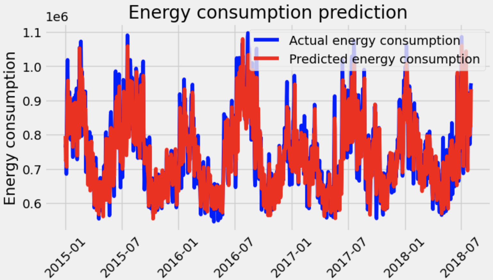
  <figcaption>Fig. 29 LSTM predictions</figcaption>
</figure>

Das LSTM trifft sehr präzise vorhersagen. Wir erhlaten folgende Werte für den RMSE und den MAPE:

LSTM RMSE: 48014.44

LSTM MAPE 4.71%

Unser LSTM hast das Prophet Modell um 3% Abweichung geschlagen. Das ist ein sehr gutes Ergebnis. Das LSTM schließt von allen Modellen am besten ab.

Hier nochmal der Vergleich der drei Modelle:

<figure markdown>
  
  <figcaption>Fig. 30 Vergleich SARIMA, Prophet and LSTM</figcaption>
</figure>

## 4 Fazit

Zeitserien haben drei wichtige Merkmale: Autokorrelation, Trend und Saison. Autokorrelation beschreibt den Zusammenhang zwischen den Werten einer Zeitreihe und ihren verzögerten Versionen. Der Trend bezieht sich auf die langfristige Veränderung des Mittelwerts der Zeitreihe. Die Saison bezieht sich auf wiederkehrende Muster in den Daten, die mit bestimmten Zeiträumen zusammenhängen.

Die Zeitreihenanalyse wird in verschiedenen Anwendungsgebieten eingesetzt, darunter Merkmalsanalyse, Vorhersage, Glättung und Anomalieerkennung. Bei der Analyse der Merkmale werden Muster und Trends in der Zeitreihe identifiziert. Die Vorhersage befasst sich mit der Schätzung zukünftiger Werte basierend auf vergangenen Daten. Die Glättung reduziert Rauschen und Schwankungen, um den Trend deutlicher zu erkennen. Die Anomalieerkennung identifiziert abnormale Muster oder Ausreißer in der Zeitreihe.

Klassische Ansätze in der Zeitreihenanalyse umfassen das exponentielle Glätten und das SARIMA-Modell. Das exponentielle Glätten reduziert kurzfristige Schwankungen und erfasst den Trend, aber berücksichtigt keine Saisonkomponente. Das SARIMA-Modell modelliert Zeitreihen mit saisonalen Mustern und berücksichtigt Autoregression, Differenzierung und Moving Average mit saisonalen Komponenten.

SARIMA-Modelle zeichnen sich durch ihre einfache Interpretierbarkeit und die geringe Anzahl an Tuning-Parametern im Vergleich zu maschinellen Lernmodellen aus. Allerdings erfordern sie stationäre Daten und haben Schwierigkeiten bei der Bewältigung mehrerer saisonaler Muster. Zudem sind sie rechenintensiv für große Datensätze.

Moderne Ansätze in der Zeitreihenanalyse haben in den letzten Jahren an Bedeutung gewonnen. Sie umfassen maschinelle Lernverfahren (XGBoost, Prophet) und Deep Learning (LSTM). Diese Ansätze können komplexe Muster erfassen und präzisere Vorhersagen liefern.

Prophet eignet sich gut für Zeitreihen mit starken saisonalen Effekten und mehreren Saisons an historischen Daten. Es kann mehrere Saisonalitäten gut handhaben und ermöglicht die flexible Einbeziehung von Feiertagseffekten und zusätzlichen Regressoren. Die Anwendung von Prophet erfordert weniger Verständnis über die zugrunde liegenden Implementierungen. Allerdings sind die Komponenten der Vorhersage nicht so leicht interpretierbar wie bei ARIMA und das Modell ist weniger effektiv für hochfrequente Daten.

Das LSTM ist eine Art von rekurrentem neuronalen Netzwerk, das komplexe nichtlineare Beziehungen modellieren kann. Es eignet sich gut für Zeitreihenprognosen, bei denen langfristige Abhängigkeiten eine Rolle spielen. Es kann auch mehrere saisonale Muster wie Prophet handhaben. Allerdings ist das Training von LSTM-Modellen langsam, insbesondere für große Datensätze, und es besteht die Gefahr der Überanpassung ohne sorgfältige Gestaltung und Regularisierung. Die Vorhersagen von LSTM-Modellen sind schwer interpretierbar und erfordern große Datenmengen für das Training.

Bei der Auswahl des geeigneten Modells für die Zeitreihenprognose ist es wichtig, die Merkmale der Daten und die Prioritäten der Aufgabenstellung zu berücksichtigen. ARIMA eignet sich gut für interpretierbare Vorhersagen, während LSTMs bei komplexen Mustern und großen Datensätzen überlegen sein können. Prophet bietet eine flexible und benutzerfreundliche Lösung für die Bewältigung mehrerer Saisonalitäten. Letztendlich gibt es kein universell bestes Modell für alle Arten von Zeitreihendaten. Die Wahl hängt von den spezifischen Anforderungen und Eigenschaften der Daten ab.

## 5 Weiterführendes Material

### 5.1 Podcast
Hier Link zum Podcast.

### 5.2 Talk
Hier einfach Youtube oder THD System embedden.

### 5.3 Demo
Hier Link zum Demo Video + Link zum GIT Repository mit dem Demo Code.


## 6 Literaturliste
[Fathi M. Salem. (2022). Recurrent Neural Networks From Simple to Gated Architectures. Springer.](https://link.springer.com/book/10.1007/978-3-030-89929-5#bibliographic-information)

[Huang, C (2022). Applied Time Series Analysis and Forecasting with Python. Springer.](https://link.springer.com/book/10.1007/978-3-031-13584-2)

[National Institute of Standards and Technologies. Introduction to Time Series Analysis.](https://www.itl.nist.gov/div898/handbook/pmc/section4/pmc4.htm)
